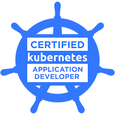
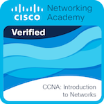

<h3 align="center">Paulina Kimak <em>(Rock Piryt)</em> </h3>

<h1 align="center"> Cloud Software Development Engineer at Intel</h1>

<h6 align="center">Visit my sites:</h6>

  <h4>Personal site with resume and portfolio</h4>
  <a href="http://paulinakimak.com" target="_blank">paulinakimak.com</a>

    

  <h4>LinkedIn profile</h4>
  <a href="https://www.linkedin.com/in/paulina-kimak-rockpiryt/" target="_blank">
    linkedin.com/in/paulina-kimak-rockpiryt
  </a>

<h2 align="center">About Me</h2>

Since July 2024, I have been working as a Cloud Software Development Engineer at Intel Technology Poland Sp. z o.o. (Internship)

In October 2025 I have successfully passed the Certified Kubernetes Application Developer (CKAD) exam.

<h2 align="center">Mentorship</h2>
Currently, I am deploying a web application on a Kubernetes cluster hosted on AWS, under the mentorship of a DevOps engineer who provides guidance and feedback on architecture, scalability, and best practices.
This collaboration helps me deepen my hands-on experience with Kubernetes, CI/CD pipelines, and cloud infrastructure.

I design, implement, and test cloud-native solutions using the following tools and technologies:

- Infrastructure as Code: Terraform
- CI/CD: GitHub Actions, ArgoCD
- Containers & Orchestration: Docker, Kubernetes
- Cloud Platform: AWS
- Observability & Monitoring: Prometheus, Grafana
- Operating System: Ubuntu (Linux)
- Programming Language: Python

This setup allows me to apply DevOps best practices, automate deployments, and gain hands-on experience in cloud infrastructure management.

<h2 align="center">AWS interest</h2>
I have a deep interest in cloud technologies. In August 2023, I successfully passed the official AWS exam, earning the AWS Certified Cloud Practitioner certification.
My next professional goal is to earn the AWS Certified Solutions Architect certification and continue developing towards a Platform Engineer / DevOps role.

To achieve my target, I participate in official AWS Cloud Quests and create real projects using AWS services. For serverless applications, I utilize Lambda, API Gateway, and DynamoDB. For standard applications, I deploy EC2 instances and RDS databases.

<h2 align="center">My achievements</h2>

<h3 align="center">Kubernetes</h3>

  
   
  <b>CKAD</b> — Certified Kubernetes Application Developer

 

<h3 align="center">AWS</h3>

  
  &nbsp;&nbsp;&nbsp;
  
  &nbsp;&nbsp;&nbsp;
  

   
  <b>AWS</b> — Cloud Practitioner + Cloud Quests

 

<h3 align="center">Cisco</h3>

  
  &nbsp;&nbsp;&nbsp;
  

   
  <b>CCNA</b> — 2/3 courses completed (badges earned)

<h2 align="center">Cloud & DevOps Projects</h2>

Production-style projects focused on Kubernetes, CI/CD, observability and cloud-native infrastructure.

<h2 align="center">Languages and Tools</h2>

<h4>Programming</h4>

  
  
  
  

<h4>Cloud & Infrastructure</h4>

  
  
  
  
  

<h4>CI/CD & GitOps</h4>

  
  
  
  
  

<h4>Observability</h4>

  
  

<h4>Databases</h4>

  
  

<h4>Networking</h4>

  
  

<h2 align="center">Developer Stats</h2>

  

  

  

 

<h2 align="center">Contact</h2>

  
  
  

Cloud-Native / DevOps Engineer • Kubernetes • CI/CD • Observability • Linux

 

  
    Built with Kubernetes, coffee, and late-night debugging ☕  
     
    © 2026 Paulina Kimak
  

