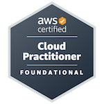

<h3 align="center">Paulina Kimak <em>(Rock Piryt)</em> </h3>

<h1 align="center">Python Developer from Gdansk, Poland</h1>

<h6 align="center">Visti my sites:</h6>

  <h4 align="center">Personal site with resume and portfolio:</h4>
  <a href="http://paulinakimak.com" target="blank" align="center">
    
paulinakimak.com

  </a>   
  <h4 align="center">LinkedIn profile:</h4>
  <a href="https://www.linkedin.com/in/paulina-kimak-rockpiryt/" target="blank" align="center">
  
https://www.linkedin.com/in/paulina-kimak-rockpiryt
  
  </a>  

<h2 align="center">About Me</h2>

I'm a hard-working programmer focus on Python language. Now on my Github you can find 5 personal projects in progress - 4 Flask web app and 2 Tkinter app.
To deploy my web app I use an AWS cloud.   I use free APIs and webscraping (Selenium /Beatful Soup) to get information.  To work with data I use Pandas and to store information SQLite database. I keen on to learning new tech stack - now I develop my skills in Django and data analysis using Anaconda.

<h2 align="center">My achivements</h2>

  <h5 align="center">
    
      <a href="https://www.credly.com/badges/e4a75e0b-64cd-4a48-888d-a36be3b032b9/public_url"> 
        
AWS Certified Cloud Practitioner  - badge Paulina Kimak

      </a>
  </h5>

<h2 align="center">My projects</h2>

  

   
   
   

   

   

   

   
  

<h2 align="center">Languages and Tools</h2>

<h4 align="left">Programing Languages:</h4>

<h4 align="left">Collection:</h4>

<h4 align="left">Storage:</h4>

<h4 align="left">Procesing:</h4>

<h4 align="left">Web Development:</h4>

  
  
  

<h4 align="left">Cloud technologies:</h4>

<h4 align="left">Workflow Tools:</h4>

<h4 align="left">Miscellaneous:</h4>

<h2 align="center">Developer Stats</h2>

<a href="https://github.com/RockPiryt?tab=repositories">Repositories Site</a> 

 

<h2 align="center">📃 Content</h2>

<h6 align="center">Follow my profiles:</h6>

<h4 align="center">Name card:</h4>
<a href="https://rockpiryt.github.io/Personal_name_card/" target="blank" align="center">
  
https://rockpiryt.github.io/Personal_name_card/
  
</a>  

 | 
   | 
   |  

- Portfolio: [Devfolio](#)

---

Paulina Kimak <https://rockpiryt.github.io/Resume/> | 2023

